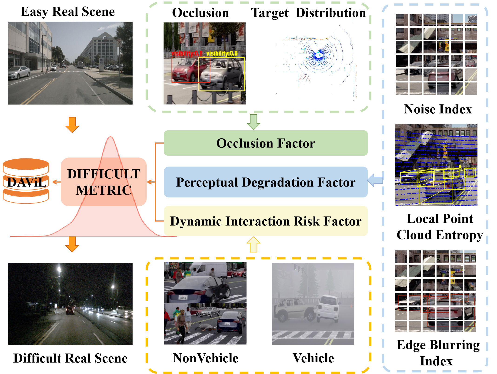
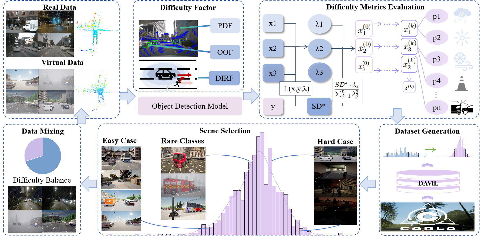
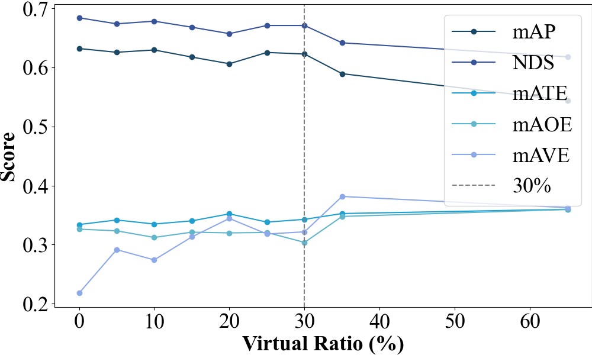

<h1 align="center">DAVR-LT: A Difficulty-Aware Virtual-Real Interaction Solution Towards Robust AD in Long-Tail Scenarios

 
 </img>

## Abstract:
Research on long-tail problems in autonomous driving (AD) perception encounters two fundamental challenges: the inherent infrequency of long-tail data acquisition in real-world deployments coupled with substantial data collection expenses, and the suboptimal exploitation of such rare data by existing algorithms, thereby impeding effective feature learning for edge-cases. To address these issues, this study proposes a difficulty-aware virtual-real interaction solution specially for robust AD in long-tail scenarios, DAVR-LT. Specifically, a unified difficulty metric is first introduced to guide the data generation, enabling more efficient long-tail scenario creation and exploitation. By integrating salient features, including target-centric pixel characteristics and point cloud quality, such a quantifiable difficulty index underpins the development of the Difficulty-Aware Virtual Long-tail Dataset (DAViL), a NuScenes-format compliant virtual dataset engineered to substantially augment data diversity and generalizability. Building upon this, a multimodal scene difficulty assessment framework integrating both dynamic and static risk factors and a difficulty-driven virtual sample fusion strategy are further explored, forming a closed-loop paradigm of “evaluation–modeling–verification” for long-tail data collection. Extensive experiments demonstrate that our proposed DAVR-LT not only furnishes a novel methodology for long-tail scenario generation but also provides both theoretical underpinnings and experimental validation for enhancing the safety and robustness of multimodal AD perception systems.

## Mechanism

## Result

### 📊 Performance Comparison of Two-Stage Incremental Strategy for Data Fusion

| Strategy | VRatio | mAP ↑    | NDS ↑    |
|----------|--------|----------|----------|
| R        | 0%     | 0.6316   | 0.6836   |
| V→R      | 15%    | **0.6348** | **0.6854** |
| V→R      | 20%    | **0.6340** | **0.6853** |

### 📊 Performance Comparison of Mixed Training with Varying Proportions of Virtual Data

| Strategy | VRatio | mAP ↑    | NDS ↑    |
|----------|--------|----------|----------|
| R        | 0%     | 0.6616   | 0.6965   |
| V+R      | 15%    | **0.6641** | **0.6997** |
| V+R      | 20%    | **0.6623** | **0.6968** |

### 📊 Performance under Different Virtual Data Ratios

## Acknowledgements 🙇
This work is built upon the CARLA simulator, which serves as the foundational platform for data generation and scenario construction. 
The algorithmic evaluation and benchmarking in our experiments are greatly inspired by prior open-source contributions, particularly UVTR and MVP. 
We sincerely thank the developers and contributors of these projects for advancing research in autonomous driving.

## License

To the extent possible under law, [Abhishek Naidu](https://abhisheknaidu.tech/) has waived all copyright and related or neighboring rights to this work.

